# Configuration de SQL Server

SQL Server nécessite une configuraiton initiale pour que SQLab puisse fonctionner.

## Configuration TCP/IP

Ouvrir `SQL Server Configuration Manager`.

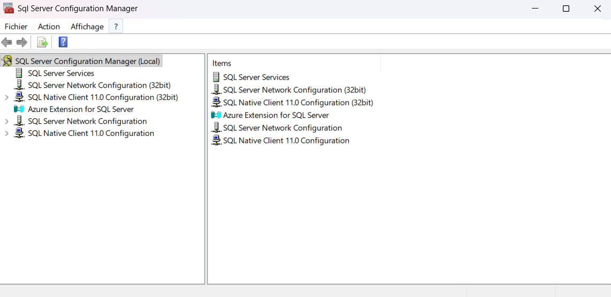

Ouvrir le menu `SQL Server Network Configuration` puis `Protocols for <instance>`.

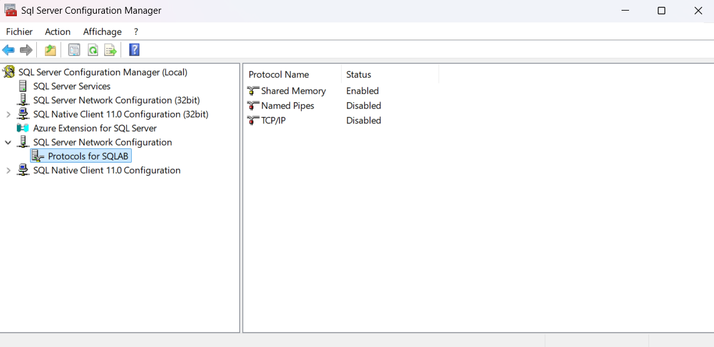

Cliquer droit sur `TCP/IP` et sélectionner `Propriétés`.

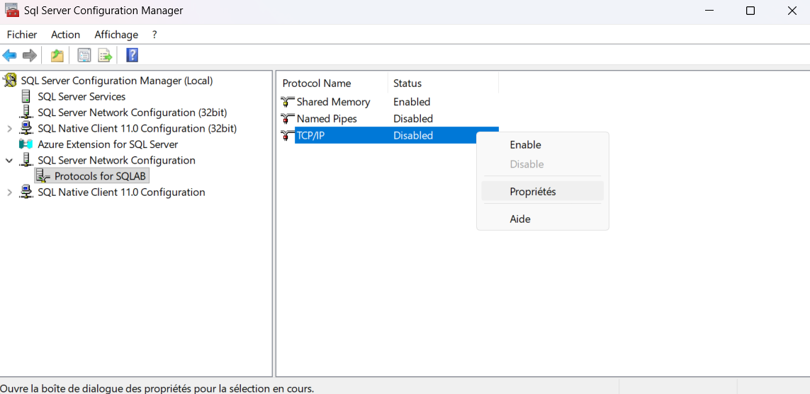

Dans la fenêtre qui s'affiche, cliquer sur le menu `IP Addresses`.

Dérouler l'ascensseur jusqu'à trouver la section `IPAll`.

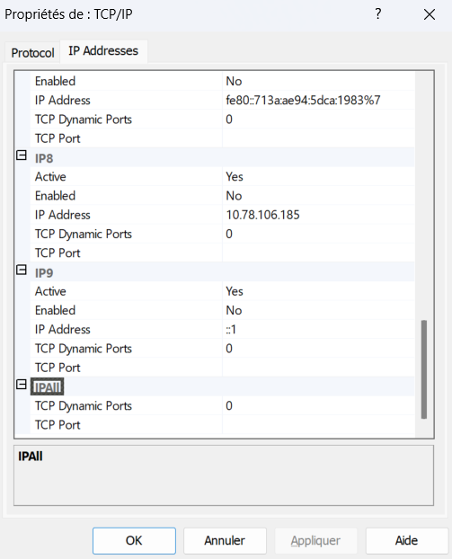

Définir les champs de la section `IPAll` selon le tableau suivant.

| Champ             | Valeur | Remarque                |
| ----------------- | ------ | ----------------------- |
| TCP Dynamic Ports |        | Le champ doit être vide |
| TCP Port          | 1433   |                         |

Cliquer sur `Appliquer`.

Cliquer sur `OK` à l'affichage de l'avertissement.

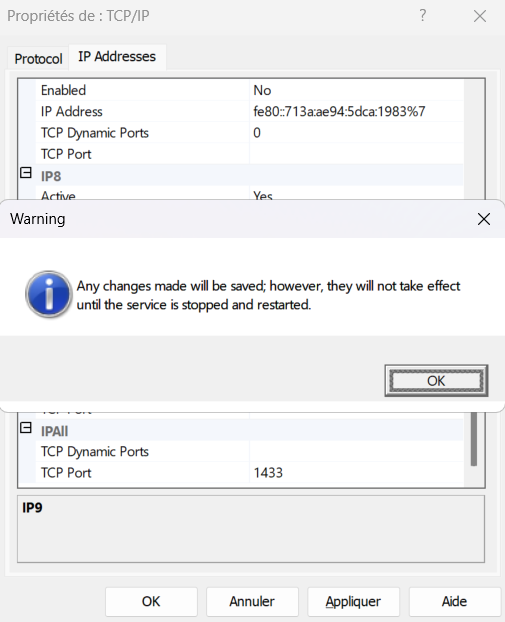

Cliquer droit sur `TCP/IP` et sélectionner `Enable`.

Cliquer sur `OK` à l'affichage de l'avertissement.

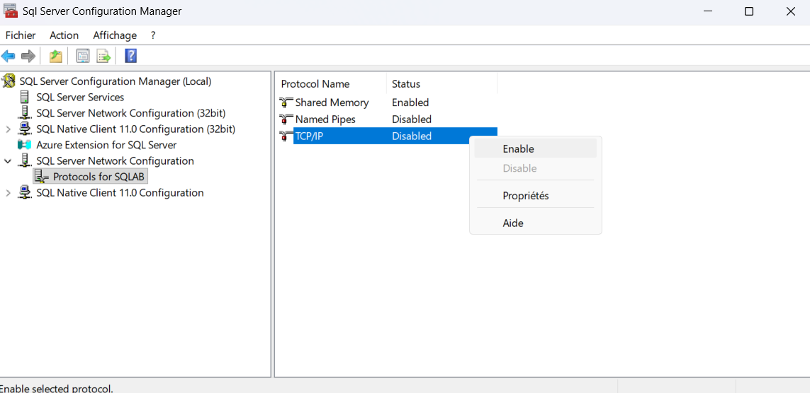

S'assurer que le protocole `TCP/IP` est bien activé.

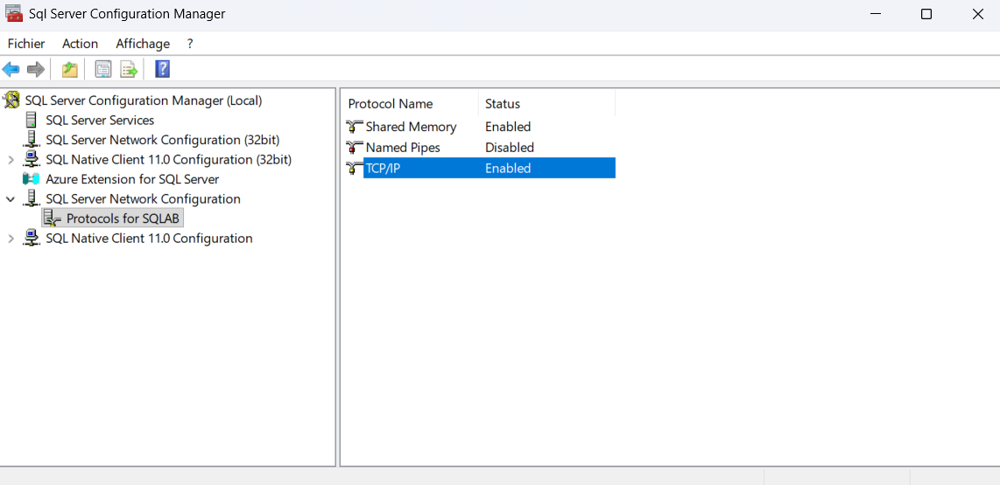

## Démarrage des services SQL Server

Ouvrir `SQL Server Configuration Manager`.

Ouvrir le menu `SQL Server Services`.

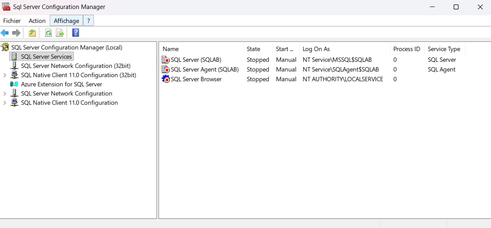

Cliquer droit sur `SQL Server(<instance>)` et sélectionner `Start`.

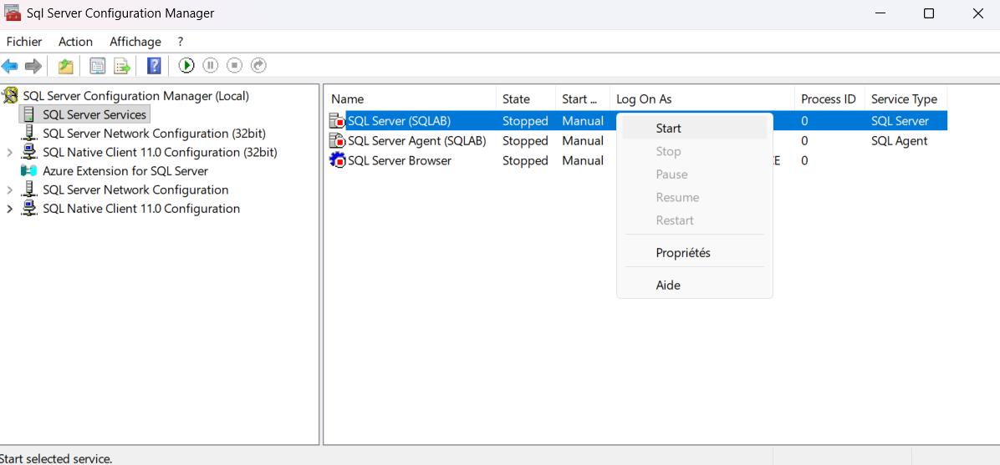

Cliquer droit sur `SQL Server Agent (<instance>)` et sélectionner `Start`.

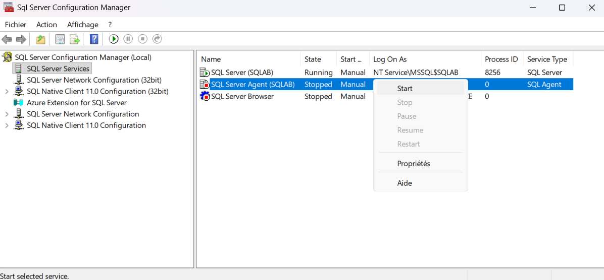

S'assurer que l'état des services `SQL Server` et `SQL Server Agent` est défini à `Running`.

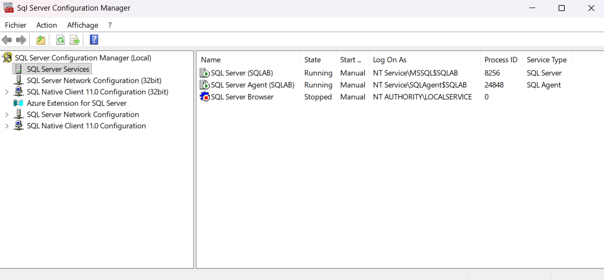
